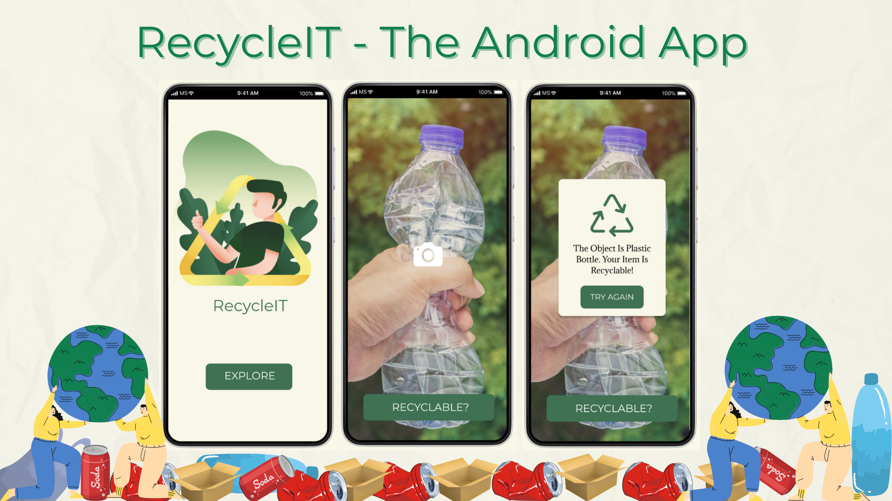

## RecycleIT - The Android App

Even though 94% of Americans support recycling and 74% say it should be a top priority, only about 35% of people actually recycle. And the major reasons behind it are sorting and convenience. With just a click, RecycleIT will not only help you identify your recyclable products but also give you a convenient location to recycle.

Our application predicts whether a product is recyclable or not. When you take a picture on your phone camera, it tells you what that object is in real-time and if you can recycle it. Our application can now detect five classes/Objects - boxes, plastic bottles, glass bottles, cans, crushed soda cans, and soda cans. We plan to add more classes and give the location of the nearest recycling center.

### How did we build this?
We build the android application using React Native. We used open-source data and analyzed the data, and pre-processed it. We trained our own model using Convolution Neural Network in python for image classification. Finally, we integrated the CNN model with the android application using TensorFlowJS.

### Technologies Used: 

1. Design Tools: Figma, Canva
2. Dataset: Open Souce Data - http://web.cecs.pdx.edu/~singh/rcyc-web/dataset.html
3. Software Tools: VSCode, Google Colab
4. Technologies: React Native, Javascript, ReactJS, Python, TensorFlow, Expo

### Video Demo

